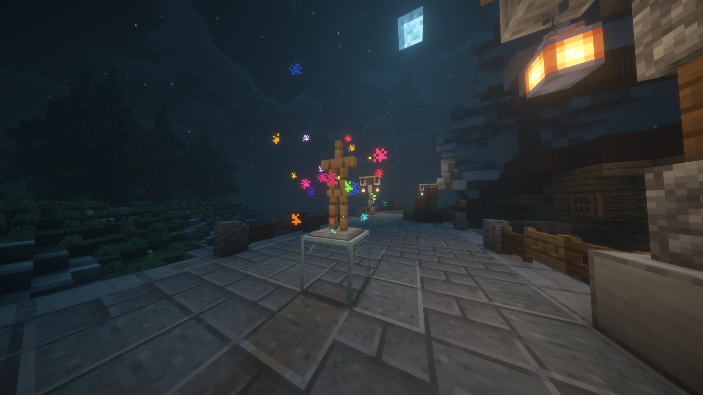

# BLSshader v10.0 AEhenry add-on

This add-on was modified by [AEhenry]() using BSL shader and is compatible with versions 1.19 to 1.21+  
Adds the following features:
- Emissive Particle
- Force Emissive Ore

 

## Emissive Particle
Adds some brightness to particle. Also you can adjust the brightness.

    <table style="width:100%">
        <tr>
            <td align="middle">
              
              <figcaption align="middle">Emissive Particle Off</figcaption>
            </td>
            <td align="middle">
               
              <figcaption align="middle">Emissive Particle On</figcaption>
            </td>
        </tr>
    </table>

 

## Force Emissive Ore
This is based on BSL shader original feature `Enhance Ore Visibility`. When enabled, it overrides that option.  
Forcibly keeps ores brightness even no light source is nearby.
